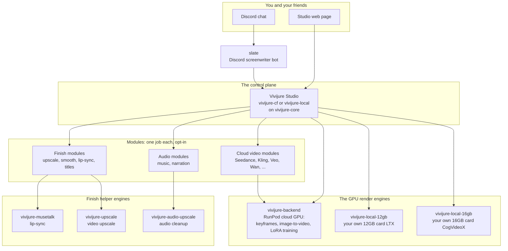

# vivijure-local-16gb

The **local-consumer** render backend for Vivijure, fidelity variant: image-to-video on a **single
16GB consumer GPU** running **CogVideoX-5B-I2V** in your own homelab. **Production-ready** as of
**v1.0.0** (July 2026): proven on real silicon, wired to the Vivijure Studio `local-gpu` module, and
safe to run beside a production control panel.

The higher-fidelity sibling of the
[LTX door](https://github.com/skyphusion-labs/vivijure-local-12gb) (12GB, lean + fast) and the
deliberate opposite of [vivijure-backend](https://github.com/skyphusion-labs/vivijure-backend) (the
RunPod datacenter engine, Wan 2.2 on H200/B200).

> **16GB floor, PROVEN.** Fit and quality were measured on real hardware (cap-sweep on RTX 4090, then
> real-content confirmation on RTX 4000 Ada under the shipped **15.5GB VRAM cap**). The full 49-frame
> tiers complete without OOM on a nominal 16GB card. Full proof:
> [docs/proof/RESULTS.md](docs/proof/RESULTS.md).

**One studio, many honest doors.** The studio's `motion.backend` hook makes the clip engine pluggable.
The control plane is unchanged; the user picks the door: rent datacenter GPU, or run it on silicon they
already own. **Pick this 16GB door for fidelity; pick the 12GB LTX door for speed** (see the trade
below).

## Releases (which image to run)

**Use a tagged release, not `:latest`.** Stable installs pin an explicit version from
**[GitHub Releases](https://github.com/skyphusion-labs/vivijure-local-16gb/releases)**.

| Release | Status | GHCR image |
|---|---|---|
| **[v1.0.0](https://github.com/skyphusion-labs/vivijure-local-16gb/releases/tag/v1.0.0)** | **Current stable** | `ghcr.io/skyphusion-labs/vivijure-local-16gb:1.0.0` |

The tracked `docker-compose.yml` pins **`1.0.0`** (see the `x-door-image` anchor at the top of that
file). When we ship a newer release, bump that pin to match the new tag, then run
`docker compose pull && docker compose up -d`. Do not rely on the floating `:latest` tag for production;
it exists for convenience only.

```
control plane --> local-gpu module (CF Worker) --/run--> tunnel --> THIS backend (CogVideoX-5B-I2V, 16GB)
```

## Where this fits: the constellation

Vivijure is not one program. It is a small group of programs that work together (we call the
whole group the **constellation**). The **Studio** is the control plane; it decides what runs and
hands the heavy render work to a GPU engine. This repo is one box on that map: the own-GPU local
render door. You choose it, and the render happens on the graphics card in your own computer.



**You are here:** vivijure-local-16gb is the own-GPU local render door (CogVideoX, 16GB card).

The full map, the same one every constellation repo shows, and how to read it, is in
**[docs/constellation.md](docs/constellation.md)**.

## Production readiness (v1.0.0)

This door is ready for a production Vivijure Studio today. What that means in plain terms:

| Gate | Status |
|---|---|
| 16GB VRAM floor proven (cap-sweep + Ada real-content) | Done |
| Clean video on native 49-frame grid (no tile noise) | Done |
| Studio `local-gpu` module integration | Done |
| `/status` stays responsive during renders (worker subprocess) | Done |
| Safe default VRAM cap (`15.5GB`) in compose | Done |
| One-command homelab bring-up (`docker compose up`) | Done |

Still out of scope for v1.0.0: CogVideoX1.5 (720p / longer clips) as a higher tier, and vGPU slices
(cloud "16Q" profiles) which produce noise on this engine -- use the [12GB LTX door](https://github.com/skyphusion-labs/vivijure-local-12gb) instead.

## Quickstart (your first run)

New box with nothing installed yet? Follow the from-scratch prerequisites (NVIDIA driver, Docker, the
NVIDIA Container Toolkit; one tested path, Ubuntu 24.04 LTS) in
**[docs/HOMELABBER.md](docs/HOMELABBER.md)**, then run `./preflight.sh` to confirm your box is ready
(it checks everything, installs nothing, and flags a vGPU slice this door cannot render on).

You need **one** thing before you start: your Vivijure studio's **Cloudflare R2 credentials**. This
backend shares that bucket -- it reads the keyframe and writes the finished clip there. Everything else
(the tunnel, the access token) is automatic.

**1. Put your R2 credentials in `.env`:**

```sh
cp .env.example .env
# edit .env and set R2_ACCOUNT_ID, R2_ACCESS_KEY_ID, R2_SECRET_ACCESS_KEY
# (R2_BUCKET defaults to "vivijure")
```

Where to get them: Cloudflare dashboard -> R2 -> Manage R2 API Tokens (scope the token to your bucket).

**2. Start it:**

```sh
docker compose pull   # fetches ghcr.io/skyphusion-labs/vivijure-local-16gb:1.0.0 (pinned in compose)
docker compose up
```

`docker compose` pulls the **v1.0.0** image named in `docker-compose.yml` (see
[Releases](https://github.com/skyphusion-labs/vivijure-local-16gb/releases) for the current stable tag).
Prefer to build from source? Run `docker compose up --build` instead.

To move to a newer GitHub Release: check out that release tag (or bump the `x-door-image` pin in
`docker-compose.yml` to the new version), then `docker compose pull && docker compose up -d`.
The compose file uses `pull_policy: missing`, so it will not silently re-pull on every restart; that
is deliberate (no surprise auto-updates).

The `ready` service prints a banner with your **Backend URL + token**, copy-paste ready. (Your FIRST
render downloads the CogVideoX weights, ~22GB once, so it takes a good while longer; later renders
skip the download.)

**3. Wire it into your studio.** Put that URL + token into your studio's `deploy.env` as
`LOCAL_BACKEND_URL` and `LOCAL_BACKEND_TOKEN`, set `INSTALL_LOCAL_GPU=1`, and run `./deploy.sh`; it
seeds the secrets, deploys the door module, and binds it to the core (see
[docs/INTEGRATION.md](docs/INTEGRATION.md)). Then pick this door in the planner and render -- a real
clip comes back from your own card. The door opens its own tunnel, so there is nothing to
configure on the door side.

> Forgot the R2 creds? The logs tell you exactly which values to set and to run `docker compose up`
> again -- a plain message, not a stack trace.

Needs an NVIDIA GPU with **16GB+ VRAM**, an NVIDIA driver **550 or newer** (the runtime is CUDA 12.4),
the [NVIDIA Container Toolkit](https://docs.nvidia.com/datacenter/cloud-native/container-toolkit/latest/install-guide.html),
and about **35GB of free disk** (a ~10GB container image + the ~22GB weights).
CogVideoX-5B needs CPU offload on any consumer card; a 12GB or 14GB card OOMs on the full 49-frame tiers
(measured). Starting from a bare Ubuntu box? **[docs/HOMELABBER.md](docs/HOMELABBER.md)** has copy-paste
steps to install the driver, Docker, and the NVIDIA Container Toolkit before you run. The full
walkthrough (tunnel, trade-offs, troubleshooting) is
**[docs/HOMELABBER.md](docs/HOMELABBER.md)**; studio-side wiring is
**[docs/INTEGRATION.md](docs/INTEGRATION.md)**.

> ### A real, dedicated GPU is required -- cloud "vGPU" slices do NOT work with this door
>
> A GRID/vGPU-sliced card (the mediated-passthrough kind many cloud "vGPU" plans rent, such as the
> NVIDIA **A16-16Q** "16Q" profile) produces **pure-noise, corrupt clips** with CogVideoX-5B, even
> though the render reports COMPLETED and the VRAM number looks right. There is no error and no
> warning -- just a valid-looking mp4 that is latent noise on every frame. This is **deterministic**,
> confirmed across multiple cloud boxes and every door version (#35). The 16GB floor above assumes
> **physical silicon** (a whole card passed through, not a slice). If your only option is a vGPU
> slice, use the **[12GB LTX door](https://github.com/skyphusion-labs/vivijure-local-12gb)** instead:
> it renders correctly on the very same vGPU hardware.
>
> The backend also DETECTS a vGPU slice at startup (from `nvidia-smi`) and prints a loud warning
> in `docker compose logs` -- it warns, it does not refuse (if you know your setup differs, proceed).

## Configuration (`.env`)

Copy `.env.example` to `.env` and fill it in. Every setting is an environment variable:

| Var | Required | Default | What it does |
|---|---|---|---|
| `R2_ACCOUNT_ID` / `R2_ACCESS_KEY_ID` / `R2_SECRET_ACCESS_KEY` | yes | -- | The one credential: the shared-R2 key (read the keyframe, write the clip). Scope it to the bucket. |
| `R2_BUCKET` | no | `vivijure` | The shared bucket name. |
| `LOCAL_BACKEND_TOKEN` | no | auto-generated | The bearer token every i2v request must carry (the tunnel is public). Blank => a strong one is generated and printed in the banner; set it for a stable token across restarts. |
| `TUNNEL_TOKEN` | no | quick tunnel | A Cloudflare named-tunnel token for a STABLE hostname (also needs the `docker-compose.override.yml` from HOMELABBER "A stable address"). Blank => a zero-config TryCloudflare quick tunnel (URL changes each restart). |
| `VIVIJURE_MAX_VRAM_GB` | no | **15.5** | Cap the VRAM vivijure claims, in GB. The backend pins torch to that fraction at startup (before model load). The shipped default is **15.5GB** so a 16GB card cannot OOM from opportunistic allocator growth; 49-frame tiers complete under this cap with model CPU offload (see `docs/proof/RESULTS.md`). On a 24GB+ card, raise in `.env` or set >= your card size for the full card. |
| `VIVIJURE_OFFLOAD` | no | blank (`model`) | How the render trades speed for VRAM. Blank keeps the safe default (`model`: evict the big text encoder between uses). `none` holds the whole model resident (faster by ~17-18s/clip) but the model is **~28GB resident (measured)**, so set it ONLY on a **>28GB card** (32GB+, i.e. 48GB-class); on 24GB or below it OOMs every tier. Proof: [docs/proof/OFFLOAD-S38.md](docs/proof/OFFLOAD-S38.md). |

The full reference -- every `.env` value, every built-in setting, the ports, the volumes, and the
per-clip settings the Studio sends -- is in **[docs/CONFIGURATION.md](docs/CONFIGURATION.md)**. You
should never need to open the compose file or the source to learn what a knob does.

### How your Studio reaches this door

The wiring is the same whether you self-host the whole Studio or point a hosted one at your box: the
Studio stores this backend's tunnel URL (`LOCAL_BACKEND_URL`) and the matching token, and its
`local-gpu` module calls this backend directly. There is no shared, multi-tenant path -- your
backend serves only the Studio you hand its URL to. The full studio-side wiring (bindings, secrets,
and the ordered flip) is in **[docs/INTEGRATION.md](docs/INTEGRATION.md)**.

## What it runs

**CogVideoX-5B-I2V** (`THUDM/CogVideoX-5b-I2V`), the true-i2v **fidelity leader** on a consumer card
(strong first-frame identity, coherent motion, real text control), chosen here as the deliberate
opposite trade-off to the LTX door's speed (the full comparison is
[docs/i2v-model-selection.md](docs/i2v-model-selection.md)). CogVideoX-5B-I2V is a **fixed-grid** model:
it renders 720x480 at 49 frames @ 8 fps (~6.1s), and can silently decode off-grid frame counts as
latent tile noise. All three quality tiers therefore stay at 49 frames and differ only by inference
**steps**. `final` is the card's honest ceiling, not datacenter parity.

Measured on the real shipped container (`enable_model_cpu_offload()` + VAE tiling/slicing, bf16).
Peak VRAM below is `max_memory_allocated` (live tensor bytes). The stack defaults to a **15.5GB cap**
so homelabbers on real 16GB cards do not OOM (see `VIVIJURE_MAX_VRAM_GB`).

| Tier | Resolution | Frames | Steps | Peak VRAM (alloc) | sec/clip (RTX 4090) | sec/clip (RTX 4000 Ada 16GB-class) |
|---|---|---|---|---|---|---|
| `draft` | 720x480 | 49 (~6.1s) | 30 | 13.57 GB | ~98s (~1.6 min) | ~511s (~8.5 min) |
| `standard` | 720x480 | 49 (~6.1s) | 40 | 13.57 GB | ~243s (~4 min) | ~682s (~11 min) |
| `final` | 720x480 | 49 (~6.1s) | 50 | 13.57 GB | ~299s (~5 min) | ~850s (~14 min, estimated from step count) |

The 4090 numbers are from the July 2026 proof gate ([docs/proof/RESULTS.md](docs/proof/RESULTS.md)).
The Ada column is the honest **homelab baseline** (propagandhi standing door, July 2026); `final` is
extrapolated from the measured standard tier (~17s/step).

The older 25-frame draft benchmark remains in `docs/proof/RESULTS.md` as historical evidence, but
that shape is withdrawn: real-content diagnostics reproduced valid-looking mp4s containing only
latent tile noise at 25 and 41 frames. The native 49-frame control rendered coherently.

Peak is **flat** across `standard`/`final` (the 49-frame VAE decode bounds it), so higher steps cost
**time, not VRAM**. All tiers use model-CPU-offload + VAE tiling/slicing.

> **SPEED CAVEAT.** The 4090 column is the fast reference card from the proof gate. A 3060 / 4070 /
> 4060 Ti / RTX 4000 Ada-class **16GB** card runs closer to the Ada column -- expect **8 to 14 minutes
> per clip**, not sub-minute. The 16GB floor is about **fit** (does it run without OOM), not speed.

### The trade vs the 12GB LTX door

| | This door (16GB, CogVideoX) | LTX door (12GB) |
|---|---|---|
| Strength | **Fidelity** (best local i2v quality) | **Speed** (few-step, sub-minute class) |
| Engine | CogVideoX-5B-I2V (5B DiT + T5-XXL) | LTX-Video (light, distilled) |
| VRAM floor | 16GB (proven) | 12GB (proven) |
| Per-clip | minutes | sub-minute to ~2 min |

Heavier model, higher fidelity, bigger card, slower clips -- the honest opposite of the lean/fast LTX
door. Run whichever fits your card and your patience.

## The job API (RunPod-compatible)

A long-running server (`src/vivijure_local/server.py`) the `local-gpu` module talks to exactly as
`own-gpu` talks to RunPod:

```
POST /run          { "input": { action: "i2v_clip", project, shot_id, prompt, keyframe_key?, config } } -> { "id" }
GET  /status/<id>  -> { id, status: IN_QUEUE|IN_PROGRESS|COMPLETED|FAILED, output?, error? }
POST /cancel/<id>  -> { ok: true }   (idempotent)
GET  /health       -> { ok: true, ... }
POST /run { "selftest": true } -> a no-GPU transport probe
```

The server owns an in-process serial job registry (a consumer card runs one i2v job at a time), the
RunPod-lifecycle stand-in for a box with no serverless platform. This contract is byte-identical to the
LTX door, so a self-hoster swaps the container without touching the studio.

## Develop (CPU: no GPU, no model weights)

```bash
python -m venv .venv && . .venv/bin/activate
pip install -r requirements-dev.txt
pytest                       # the full CPU suite (config, vram, frame math, jobs, server routing)
python -m py_compile src/vivijure_local/*.py
```

The pure logic is CPU-tested and green; the torch/diffusers generation body is deferred-imported and
validated on the card. The body raises a clear error rather than faking output if the GPU runtime is
absent -- a producer stage never ships a fake clip.

## The benchmark (proof gate)

`scripts/benchmark.py` runs the CogVideoX i2v engine across the three tiers on the card, capturing fit
(peak VRAM / OOM), speed (sec/clip), and a real sample clip per tier, then writes a report. It is how
the 16GB floor was proven ([docs/proof/RESULTS.md](docs/proof/RESULTS.md)); it does NOT run without a
GPU. See [docs/live-benchmark-plan.md](docs/live-benchmark-plan.md) for the method.

## Security boundary

One credential: the shared-R2 key (read the keyframe, write the clip). Input is control-plane-trusted
(the module only reaches the box through the studio's service binding + your tunnel). The
`LOCAL_BACKEND_TOKEN` is REQUIRED on every i2v request (the tunnel is public; an unconfigured token
makes the i2v endpoint refuse to serve). The backend holds no studio secrets and no submitter identity.

## Who this is for

Homelab builders with a **16GB consumer GPU** who want higher-fidelity Vivijure image-to-video (CogVideoX-5B) locally without RunPod rent.

**Vivijure Studio:** https://vivijure.com · **Live demo:** https://demo.vivijure.com · **Skyphusion Labs:** https://skyphusion.org

## Support

Questions, bugs, or ideas? Start with this repo's [GitHub Issues](../../issues); see
[SUPPORT.md](SUPPORT.md) for how to ask and what to include. Found a security problem? Report it
privately per [SECURITY.md](SECURITY.md), never as a public issue.

## License

**AGPL-3.0-only.** A labor of love, given freely: use it, learn from it, self-host it, build your own
creative visions on it. Run it as a network service and the AGPL has you share your changes back, so it
stays a commons. It is not for sale, and not to be resold as a SaaS.

Licensed under AGPL-3.0-only. See [LICENSE](LICENSE).
